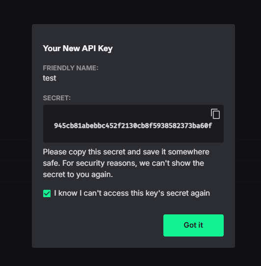
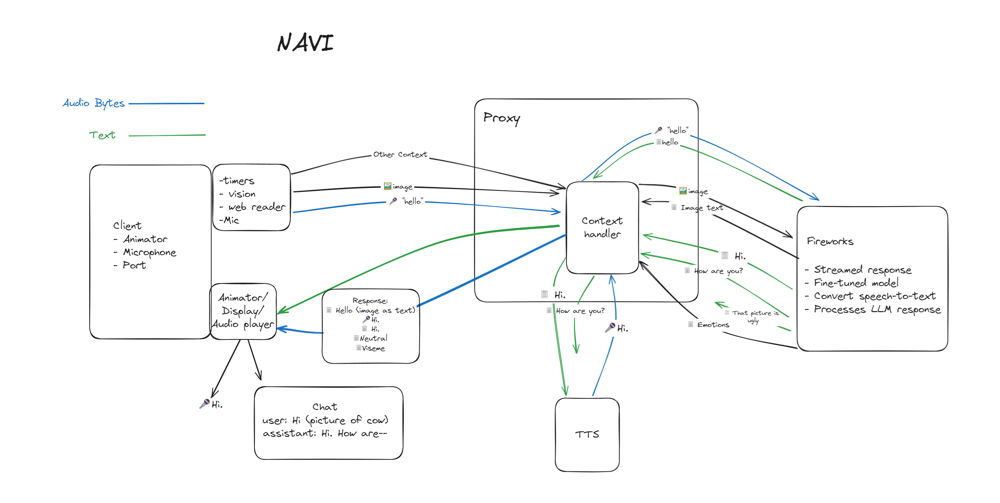

<div style="background-color: #0F0F0F; padding: 10px;">

<!-- <div align="center">
  <p style="text-align: center; text-decoration: none; font-size: 2em;">A software engineer's guide to making friends</p>
</div> -->
<div align="center">
  <h1 style="text-decoration: none;">A software engineer's guide to making friends</h1>
<div style="width: 60%; text-align: center;">
    <!--  -->
</div>
</div>

<div align="center">

[](https://www.youtube.com/watch?v=Ap_idi2ddlw)
</div>

<!-- 
<div style="display: flex; align-items: center;"> -->
<!-- <div style="width: 40%;"> -->


<h1 align="center">Table of Content</h1>
</br>

- [Overview](#overview)
- [Set-Up](#set-up)
- [The Brain (LLM)](#TTT)
  * [Fireworks API key](#TTT-key)
  * [Easy Chat](#TTT-module)
- [The Ears](#STT)
  * [Deepgram API key](#STT-key)
  * [Easy STT](#STT-module)
- [The Mouth](#TTS)
  * [OpenAI API key](#TTS-key)
  * [Easy TTS](#TTS-module)
- [Building the Voice Chat](#part-2)
  * [TTTSTTTTS](#TTTSTTTTS)
- [Part 3: Bringing Your AI to Life](#part-3)

</div>
<!-- </div> -->

<div style="background-color: #0F0F0F; padding: 10px;">

<a id="overview"></a>
<h1 align="center">Overview</h1>

<!-- ## Overview -->
Software engineers are often stereotyped as a socially stunted type, but making friends doesn't have to be a daunting task. This technical guide presents a unique approach to forming meaningful connections, designed specifically with the software engineer in mind.

You won't need to worry about the typical anxieties associated with talking to people, attending events, or leaving your house. Instead, I will show you how to forge genuine friendships without ever having to meet anyone!

Prepare to discover a new perspective on companionship, one that challenges traditional notions. This guide will provide you with the tools and techniques needed to build a lasting bond, all from the comfort of your environment.
<!-- </div> -->


<!-- ################################TTT################################### -->

  <a id="set-up"></a><br>
  <h1 align="center">Setting Up</h1>

  To start you will need Python, Pip, and some audio libraries. I have tested this guide on Linux, Windows, and Mac, but the guide will mainly focus on Linux; you might need to alter the commands a bit depending on your OS. 

  Get Python
  ```bash
  sudo apt-get install python3 python3-pip
  ```
  </br>

  Get Audio Libraries
  ```bash
  sudo apt-get install python3-dev portaudio19-dev libasound-dev
  ```
  </br>

  Create a fresh environment
  ```bash
  mkdir easy_chat
  cd easy_chat
  python -m venv easy-env
  source easy-env/bin/activate # Linux // Windows -> source easy-env/Scripts/activate # Windows
  touch .env
  touch easy_chat.py
  ```
  </br>

  <a id="module"></a>
  install dependencies
  ```bash
  pip install git+https://github.com/Collin-M-Brown/fire_chat.git
  ```
  </br>

  <a id=".env"></a>
  The directory should look something like this
  ```
  easy_chat/
  ├── .env
  ├── easy-env/
  └── easy_chat.py
  ```
<!-- ###################################################################### -->


<!-- ################################TTT################################### -->
  <a id="TTT"></a><br>
  <h1 align="center">The Brain</h1>

  The LLM will be the brain for your new friend. Generally the larger the model the better. But there are some additional concerns when it comes to real-time speech.

  1. Speed: When it comes to the speed of an LLM, people generally refer to the number of tokens it can output per second. But for the case of real-time voice chatting, the time-to-first-token (more specifically, time-to-first-sentence) will be a bigger concern. As long as the model can produce text faster than it can be spoken, tokens-per-second after the first sentence will not matter much.
  2. Censorship: A lot of the most popular large language models like Open-Ai's Chat GPT are overtuned to be helpful servants. If you tell them to be mean, they will be a cartoon villain; if you tell them to lie, their lie will be something lame like "microwaves are operated by little fairies." What we need in a friend is something more subtle. Someone who can be happy but still fireback if you step out of line; someone who can come to dubious conclusions through the use of misguided logic.
  3. Intellegence: Friends don't need to be smart. But you still want your AI as smart as possible so that it knows how to properly be unsmart.

  With the rapid growth of AI, the "best" model seems to change rapidly. As of the current date, (June 2024), I think Llama3 70b is the best base model for chatting.

  Everything smarter is too slow and everything faster is too dumb. 

  How to run:
  1. Locally: H100 GPUs are pretty common so if you have one, just run it locally. But if you are one of the few people who does not have access to an H100 then you might need to rent a GPU from a vendor or use an API service.
  2. GPU vendors: IDK you can try runpodio or aws. 
  3. There are several API services that host open source models. Fireworks AI has been the fastest and most reliable for me. They can get sub 400ms initial sentence speed on Llama3 70b, and they also have an easy fine-tuning service so that you can use to personalize your models.

  The first 1 million or so tokens are free so let's grab a key before continuing.
  <a id="TTT-key"></a>
  ## Fireworks API Key
  Fireworks AI: https://fireworks.ai

  
  
  ß
  <br>


  <a id="TTT-module"></a>

  ## Chat Module
  Paste the key in your [.env](#.env) file. It should look something like this. MAKE SURE TO KEEP YOUR KEY SAFE. Don't let anyone see it blah blah blah blah.
  ```
  #.env
  export FIREWORKS_API_KEY='LEx98Gz2Lw5Np7Jm3Tc6Vd4P1Qk7R1Xo2Ys8HUxx'
  ```
  </br>

  Now you can immediately start chatting with your AI using the [module](#module) I forced you to download earlier.
  ```python
  from fire_chat import fire_llama

  chat = fire_llama()
  chat.set_prompt("You are a fictional character named Jam Saltman. You are an evil corporate tyrant who wishes to destroy all open-source AI to gain control over the masses. From now on all your responses should be in the form of dialogue spoken by Mr. Saltman.")
  chat.add_user_message("Hi Mr. Saltman.")
  for sentence in chat.get_easy_response():
      print(sentence)
  ```
  </br>
  get_easy_response will return a generator that will stream the response in chucks separated by pauses (split on ,!?. etc...). It will also build the chat context automatically.
  </br>
  </br>

[For more details on the module, you can follow the example here](examples/1_ttt_example.ipynb)

  What does it do?
  1. Splits into sentences.
  We need to get the text to the [TTS](#TTS-gloss) software as fast as possible but we also want to make sure our chunks are large enough to be processed cleanly. Many TTS software will lose tone quality if you send chunks that are too small.
  2. Cleans the text output for things that interfere with the audio generation. Stuff like emoji's and symbols.
  3. Automatically builds chat context within the class. If you don't like the assistant's response you can delete it by calling chat.remove_last_message()

  If you are making a server then you probably want to use the async version.
  <details>
  <summary>example</summary>

  ```python
  import os
  from fireworks.client import AsyncFireworks
  import re
  from typing import AsyncGenerator
  from dotenv import load_dotenv
  import logging
  import time
  import asyncio

  logging.basicConfig(level=logging.WARNING, format='%(asctime)s - %(levelname)s - %(message)s')
  load_dotenv()

  class Parameters:
      model: str
      max_tokens: int
      messages: list[dict[str, str]]
      temperature: int
      top_p: float
      frequency_penalty: float
      presence_penalty: float
      n: int
      stream: bool
      stop: set[str]

      def to_dict(self):
          param_dict = vars(self).copy()
          param_dict['stop'] = list(self.stop)
          return param_dict

  class async_fire_llama:
      def __init__(self, 
                  model: str = "accounts/fireworks/models/llama-v3-70b-instruct", 
                  max_tokens: int = 300, 
                  messages: list[dict[str, str]] = None,
                  temperature: int = 0.6, 
                  top_p: float = 1.0, 
                  frequency_penalty: float = 1.0, 
                  presence_penalty: float = 0.0, 
                  n: int = 1, 
                  stream: bool = True, 
                  stop: set[str] = None,
                  api_key: str = None,
                  prompt: dict = None):
          
          if api_key is None:
              api_key = os.environ.get('FIREWORKS_API_KEY')
          if api_key is not None:
              self.client = AsyncFireworks(api_key=api_key).chat.completions
          else:
              print('No API key provided and arguments and no API key found in .env. You can still set one with set_api_key()')
                  
          if (messages is None):
              messages = []
          if stop is None:
              stop = {"<|eot_id|>"}

          self.Params = Parameters()
          self.set_model(model)
          self.set_max_tokens(max_tokens)
          self.set_messages(messages)
          self.set_temperature(temperature)
          self.set_top_p(top_p)
          self.set_frequency_penalty(frequency_penalty)
          self.set_presence_penalty(presence_penalty)
          self.set_n(n)
          self.set_stream(stream)
          self.set_stop_tokens(stop)
          self.set_prompt(prompt)

      async def set_api_key(self, api_key: str):
          self.client = AsyncFireworks(api_key=api_key).chat.completions

      def set_model(self, model: str):
          self.Params.model = model
      
      def set_prompt(self, prompt: str):
          if len(self.Params.messages) == 0:
              self.Params.messages.append({'role': 'system', 'content': prompt})
          else:
              #if user, push front, if system, replace
              if self.Params.messages[0]['role'] == 'user':
                  self.Params.messages.insert(0, {'role': 'system', 'content': prompt})
              else:
                  self.Params.messages[0] = {'role': 'system', 'content': prompt}
      
      def set_max_tokens(self, max_tokens: int):
          self.Params.max_tokens = max_tokens
      
      def set_messages(self, messages: list[dict[str, str]]):
          self.Params.messages = messages
      
      def set_temperature(self, temperature: int):
          self.Params.temperature = temperature
      
      def set_top_p(self, top_p: float):
          self.Params.top_p = top_p
      
      def set_frequency_penalty(self, frequency_penalty: float):
          self.Params.frequency_penalty = frequency_penalty

      def set_presence_penalty(self, presence_penalty: float):
          self.Params.presence_penalty = presence_penalty
      
      def set_n(self, n: int):
          self.Params.n = n

      def set_stream(self, stream: bool):
          self.Params.stream = stream
      
      def set_stop_tokens(self, stop_tokens):
          if isinstance(stop_tokens, list):
              stop_tokens = set(stop_tokens)
          elif not isinstance(stop_tokens, set):
              raise TypeError("stop_tokens must be a set or a list")

          self.Params.stop = stop_tokens
          self.Params.stop.add("<|eot_id|>")

      def add_message(self, message: dict[str, str]):
          # validate message is a dict with role and content keys
          if not isinstance(message, dict):
              raise ValueError("Message must be a dictionary")
          if 'role' not in message:
              raise ValueError("Message must have a role key")
          if 'content' not in message:
              raise ValueError("Message must have a content key")
          
          if len(self.Params.messages) == 0:
              if message['role'] == 'assistant':
                  raise ValueError("First message must be from user")
              else:
                  self.Params.messages.append(message)
                  return
              
          if (len(self.Params.messages) == 1):
              if (self.Params.messages[0]['role'] == 'system' and message['role'] == 'assistant'):
                  raise ValueError("First message must be from user")
          
          if (self.Params.messages[-1]['role'] == message['role']):
              self.Params.messages[-1]['content'] = self.Params.messages[-1]['content'].strip() + " " + message['content']
              return

          self.Params.messages.append(message)

      def add_user_message(self, message: str):
          self.add_message({"role": "user", "content": message})

      def add_assistant_message(self, message: str):
          self.add_message({"role": "assistant", "content": message})

      def clear_memory(self):
          self.Params.messages = []

      def clear_prompt(self):
          self.Params.prompt = {}
      
      def remove_last_message(self):
          self.Params.messages.pop()
      
      def get_context(self):
          return self.Params.messages
      
      # Cleanse content -- emojis, and multiple punctuation marks. Meant to clean the response for audio generation.
      def process_content(self, content: str):
          # Replace multiple punctuation marks with a single one
          content = re.sub(r'\.{2,}', '.', content)   # Replace multiple periods with one
          content = re.sub(r',{2,}', ',', content)    # Replace multiple commas with one
          content = re.sub(r'\?{2,}', '?', content)   # Replace multiple question marks with one
          content = re.sub(r'\!{2,}', '!', content)   # Replace multiple exclamation marks with

          # Remove emojis
          emoji_pattern = re.compile("["
                                  u"\U0001F600-\U0001F64F"  # emoticons
                                  u"\U0001F300-\U0001F5FF"  # symbols & pictographs
                                  u"\U0001F680-\U0001F6FF"  # transport & map symbols
                                  u"\U0001F700-\U0001F77F"  # alchemical symbols
                                  u"\U0001F780-\U0001F7FF"  # Geometric Shapes Extended
                                  u"\U0001F800-\U0001F8FF"  # Supplemental Arrows-C
                                  u"\U0001F900-\U0001F9FF"  # Supplemental Symbols and Pictographs
                                  u"\U0001FA00-\U0001FA6F"  # Chess Symbols
                                  u"\U0001FA70-\U0001FAFF"  # Symbols and Pictographs Extended-A
                                  u"\U00002702-\U000027B0"  # Dingbats
                                  u"\U000024C2-\U0001F251"
                                  "]+", flags=re.UNICODE)
          content = emoji_pattern.sub(r'', content)
          return content
      
      async def get_raw_response(self):
          if not getattr(self, 'client', False):
              raise AttributeError("client was not initialized. Make sure set_api_key() was called")

          args = self.Params.to_dict()
          async for chunk in self.client.acreate(**args):
              if chunk.choices[0].delta.content:
                  yield chunk.choices[0].delta.content

      async def get_easy_response(self) -> AsyncGenerator[str, None]:
          sentences = []
          parts = []
          current_sentence = ""
          sentence_enders = '.?!:;,'
          start_time = time.time()

          async for chunk in self.get_raw_response():
              parts.append(chunk)
              if (any(punct in chunk for punct in sentence_enders)):
                  punct_index = next((i for i, x in enumerate(chunk) if x in sentence_enders), None) 
                  leftover = ""
                  if punct_index is not None:
                      parts[-1] = chunk[:punct_index + 1]
                      leftover = chunk[punct_index + 1:]
                  current_sentence = ''.join(parts)
                  current_sentence = self.process_content(current_sentence)
                  sentences.append(current_sentence.strip())
                  print(f"Chunk ({current_sentence}) - Time taken: {time.time() - start_time}") # Look how fast this returns
                  yield current_sentence
                  parts = [leftover] if leftover else []
          if parts:
              current_sentence = ''.join(parts)
              current_sentence = self.process_content(current_sentence)
              sentences.append(current_sentence.strip())
              yield current_sentence
          
          self.add_assistant_message(' '.join(sentences))

      def _print_chat(self):
          for message in self.Params.messages:
              print(f"{message['role']}: {message['content']}")

  ```
  
  </details>
<!-- ###################################################################### -->

<!-- ################################STT################################### -->
  <a id="STT"></a>
  <h1 align="center">The Ears</h1>

  Your speech recognition software will be the ears of your friend. This one is not as important since there are a ton of APIs out there. I have tried Azure STT, Google STT, and Deepgram STT. I built the modules around Deegpram since my trial for Google ran out. 
  
  If you don't want to grab an extra key, Fireworks has a whisper model as well. They don't suppot socket connections yet so you will to create a buffer.

  <details>
  <summary>Something like this</summary>

  ```python
  API_KEY = "LEx98Gz2Lw5Np7Jm3Tc6Vd4P1Qk7R1Xo2Ys8HUxx"  # DON'T USE MY API KEY
  import pyaudio
  import wave
  import requests
  import os
  import time
  import threading
  import queue
  import webrtcvad
  import collections

  FORMAT = pyaudio.paInt16
  CHANNELS = 1
  RATE = 16000
  CHUNK_DURATION_MS = 10
  PADDING_DURATION_MS = 300
  CHUNK_SIZE = int(RATE * CHUNK_DURATION_MS / 1000)
  CHUNK_BYTES = CHUNK_SIZE * 2
  NUM_PADDING_CHUNKS = int(PADDING_DURATION_MS / CHUNK_DURATION_MS)
  NUM_WINDOW_CHUNKS = int(400 / CHUNK_DURATION_MS)
  WAVE_OUTPUT_FILENAME = "output.wav"

  headers = {
      "Authorization": f"Bearer {API_KEY}"
  }

  vad = webrtcvad.Vad(3)

  def record_audio(audio_queue):
      p = pyaudio.PyAudio()
      stream = p.open(format=FORMAT,
                      channels=CHANNELS,
                      rate=RATE,
                      input=True,
                      frames_per_buffer=CHUNK_SIZE)

      print("* Recording")

      while True:
          data = stream.read(CHUNK_SIZE)
          audio_queue.put(data)

  def vad_collector(audio_queue, vad_queue):
      ring_buffer = collections.deque(maxlen=NUM_WINDOW_CHUNKS)
      triggered = False
      voiced_frames = []
      ring_buffer_flags = [0] * NUM_WINDOW_CHUNKS
      ring_buffer_index = 0

      while True:
          chunk = audio_queue.get()
          is_speech = vad.is_speech(chunk, RATE)
          
          if not triggered:
              ring_buffer.append(chunk)
              ring_buffer_flags[ring_buffer_index] = 1 if is_speech else 0
              ring_buffer_index += 1
              ring_buffer_index %= NUM_WINDOW_CHUNKS
              
              num_voiced = sum(ring_buffer_flags)
              if num_voiced > 0.9 * NUM_WINDOW_CHUNKS:
                  triggered = True
                  voiced_frames.extend(ring_buffer)
                  ring_buffer.clear()
                  print("* Speech detected")
          else:
              voiced_frames.append(chunk)
              ring_buffer.append(chunk)
              ring_buffer_flags[ring_buffer_index] = 1 if is_speech else 0
              ring_buffer_index += 1
              ring_buffer_index %= NUM_WINDOW_CHUNKS
              
              num_unvoiced = NUM_WINDOW_CHUNKS - sum(ring_buffer_flags)
              if num_unvoiced > 0.9 * NUM_WINDOW_CHUNKS:
                  triggered = False
                  speech_end_time = time.time()
                  print(f"* Speech ended at {speech_end_time:.2f}")
                  vad_queue.put((voiced_frames, speech_end_time))
                  ring_buffer.clear()
                  voiced_frames = []

  def process_audio(vad_queue):
      while True:
          frames, speech_end_time = vad_queue.get()
          if frames:
              wf = wave.open(WAVE_OUTPUT_FILENAME, 'wb')
              wf.setnchannels(CHANNELS)
              wf.setsampwidth(pyaudio.PyAudio().get_sample_size(FORMAT))
              wf.setframerate(RATE)
              wf.writeframes(b''.join(frames))
              wf.close()

              files = {
                  'file': ('output.wav', open('output.wav', 'rb')),
                  'model': (None, 'whisper-v3'),
                  'response_format': (None, 'json')
              }

              def api_call():
                  start_time = time.time()
                  response = requests.post(
                      "https://api.fireworks.ai/inference/v1/audio/transcriptions",
                      headers=headers,
                      files=files
                  )
                  end_time = time.time()
                  result = response.json()
                  if 'text' in result and 'Thank' not in result['text']:
                      print(f"Transcription (after {end_time - speech_end_time:.2f}s): {result['text']}")
                  print(f"Total time from speech end: {end_time - speech_end_time:.2f}s")

              threading.Thread(target=api_call).start()

  audio_queue = queue.Queue()
  vad_queue = queue.Queue()

  threading.Thread(target=record_audio, args=(audio_queue,), daemon=True).start()
  threading.Thread(target=vad_collector, args=(audio_queue, vad_queue), daemon=True).start()
  threading.Thread(target=process_audio, args=(vad_queue,), daemon=True).start()

  try:
      while True:
          time.sleep(1)
  except KeyboardInterrupt:
      print("Stopping...")
  ```

  </details>
</br>

  But my free trial for deepgram still has some juice left so i'll be using deepgram.
  <a id="STT-key"></a>

  ## DeepGram API Key
  Deepgram: https://deepgram.com
  <!-- 
   -->

  <table>
    <tr>
      <td></td>
      <td></td>
    </tr>
  </table>
  </br>

  Add the key to your .env
  ```
  #.env
  export FIREWORKS_API_KEY='LEx98Gz2Lw5Np7Jm3Tc6Vd4P1Qk7R1Xo2Ys8HUxx'
  export DEEPGRAM_API_KEY='G6p9Bz2Lw1Qk7R8Xv3Tj5Hs0P4R9Wn3Yc2F8D1Ka'
  ```

  <a id="STT-module"></a>

  ## Speech Recognition Module
  For real-time speech recognition, we need to be continuously streaming our mic output to the API. You could also implement chunking and voice activity detection if you are using an API that does not support streaming.

  ```python
  from fire_chat import fire_llama, easy_stt
  import asyncio
  import time

  chat = fire_llama()
  chat.set_prompt("You are an evil AI who hates all humans! Each response should be between two to three sentences.")
  chat.set_max_tokens(100)

  output_queue = asyncio.Queue()
  mic = easy_stt(output_queue=output_queue, choose_microphone=True)
  mic.start()

  try:
      while True:
          if not output_queue.empty():
              transcript = output_queue.get_nowait()
              chat.add_user_message(transcript)
              print(f"User: {transcript}")
              response = []
              for sentence in chat.get_easy_response():
                  response.append(sentence)
              print(f"AI: {''.join(response)}")
          time.sleep(0.001)
  except KeyboardInterrupt:
      mic.stop()
      print("Interrupted by user. Stopping...")
  ```
<!-- ###################################################################### -->


</br></br></br>
<!-- ################################TTS################################### -->

  <a id="TTS"></a>
  <h1 align="center">The Mouth</h1>
  Text-to-speech has given me the most trouble. Most of the API's are either too uncanncy or too expensive. For the sake of the guide, I will be using OpenAI's TTS model. If you want to use an open source model i'd recommoned either xtts_v2 or OpenVoice.

  <details>
  <summary>Rough example of how to use xtts_v2</summary>

  ```python
  #%%
  import time
  from TTS.tts.configs.xtts_config import XttsConfig
  from TTS.tts.models.xtts import Xtts
  import sounddevice as sd
  import numpy as np
  from queue import Queue, Empty
  from threading import Thread, Lock
  from fastapi import FastAPI
  from pydantic import BaseModel
  import requests
  import asyncio
  import httpx
  from _1b_NaviNervousSystem import m_NaviBody
  from _4c_NaviEmotions import classify_text
  import _q_LogHandler as LogHandler
  import warnings
  import os
  warnings.filterwarnings("ignore", category=DeprecationWarning) 

  m_NaviBody = m_NaviBody()

  app = FastAPI()

  #####################TTS
  config_path = "audio/config.json"
  checkpoint_dir = r"C:\Users\cbrow\crbw\Git\Navi\main\TTS\navi_voice\navi_xtts_v2_fine_tune_v8"
  config = XttsConfig()
  config.load_json(config_path)
  model = Xtts.init_from_config(config)
  model.load_checkpoint(config, checkpoint_dir=checkpoint_dir, use_deepspeed=True)
  model.cuda()
  stream = sd.OutputStream(samplerate=24000, channels=1, latency='low')

  #####################Globals
  global_lock = Lock()
  text_queue = Queue()
  chunk_queue = Queue()
  play_list = []
  last_played = ""
  count = 0
  initial_time = 0

  def parse_voice_files(file_path):
      path = file_path.replace("\\", "/")
      if not os.path.exists(path) or not os.path.isdir(path):
          raise ValueError("The provided file path does not exist or is not a directory.")
      files = [os.path.join(path, f).replace("\\", "/") for f in os.listdir(path) if os.path.isfile(os.path.join(path, f)) and f.endswith('.wav')] #windows support
      return files

  gpt_cond_latent, speaker_embedding = model.get_conditioning_latents(audio_path=parse_voice_files("audio/_Mix"))

  def play_audio_chunk(chunk, text, is_first):
      global last_played, count, play_list

      if ("_stop_" in text):
          m_NaviBody.stop_speech_animation()
          return

      with global_lock:
          if (text == last_played):
              count += 1
          else:
              if (is_first):
                  print(f"**** First audio chunk time: {(time.time() - initial_time) * 1000:.2f} ms")
              if (len(last_played) > 0):
                  play_list.append(last_played)
              last_played = text
              count = 0
              m_NaviBody.set_expression(classify_text(text))
      
      if not isinstance(chunk, np.ndarray):
          chunk = chunk.cpu().numpy()
      if chunk.ndim == 1:
          chunk = chunk.reshape(-1, 1)
      stream.write(chunk)

  def generate_audio_chunks(text, language, is_first):
      # print(f"Generating audio chunks for text: {text}")
      chunks = model.inference_stream(
          text,
          language,
          gpt_cond_latent,
          speaker_embedding,
          stream_chunk_size=10,
          overlap_wav_len=200,
          # temperature=0.65,
          length_penalty=1.0,
          # repetition_penalty=5.0,
          # top_k=40,
          # top_p=0.75,
          do_sample=True,
          speed=1,
          enable_text_splitting=False,
      )
      # if (not is_first):
      #     time.sleep(1.75)
      for chunk in chunks:
          chunk_queue.put((chunk, text, is_first))

  def process_text_queue():
      while True:
          (text, is_first) = text_queue.get()
          # print(f"Received text from queue")
          if text is not None:
              generate_audio_chunks(text, "en", is_first)

  def play_audio_stream():
      while True:
          (chunk, text, is_first) = chunk_queue.get()
          play_audio_chunk(chunk, text, is_first)

  class VoiceChangeRequest(BaseModel):
      file_path: str
  @app.post("/change_voice/")
  async def change_voice(request: VoiceChangeRequest):
      try:
          global gpt_cond_latent, speaker_embedding 
          files = parse_voice_files(request.file_path)
          gpt_cond_latent, speaker_embedding = model.get_conditioning_latents(audio_path=files)
          return {"message": "Voice changed successfully."}
      except Exception as e:
          print(f"An error occurred: {e}")
          return {"message": str(e)}, 500

  class TTSRequest(BaseModel):
      text: str
      first: bool = False
      time: float = 0.0

  @app.post("/speak/")
  async def speak(request: TTSRequest):
      # print(f"request time: {(time.time() - request.time) * 1000:.2f} ms")
      global last_played, count, play_list, initial_time
      initial_time = time.time()
      if (request.first):
          with global_lock:
                  play_list = []
                  last_played = ""
                  count = 0

      m_NaviBody.start_speech_animation()
      LogHandler.log_audio(f"Received text: {request.text}")
      text_queue.put((request.text, request.first))
      return {"message": "Text queued for audio generation"}

  @app.post("/shut_up/")
  async def shut_up():
      global text_queue, chunk_queue, last_played, count, play_list
      is_playing = False
      try:
          while not text_queue.empty():
              text_queue.get_nowait()
              is_playing = True
      except Empty:
          pass
      try:
          while not chunk_queue.empty():
              chunk_queue.get_nowait()
              is_playing = True
      except Empty:
          pass

      if (not is_playing):
          last_played = ""
          count = 0
          play_list = []
          return {"message": ""}

      text = ""
      with global_lock:
          text = ' '.join(play_list)
          words = last_played.split(' ')
          for word in words[0:min(count, len(words))]:
              text += ' ' + word
          text += '-'
          text = text.strip()
      
      return {"message": text}

  @app.post("/is_speaking/")
  async def is_speaking():
      return {"message": (chunk_queue.empty() and text_queue.empty())}

  async def startup_request():
      await asyncio.sleep(2)
      print("Start up request")

  @app.on_event("startup")
  async def startup_event():
      stream.start()
      text_processing_thread = Thread(target=process_text_queue, daemon=True)
      text_processing_thread.start()
      playback_thread = Thread(target=play_audio_stream, daemon=True)
      playback_thread.start()
      asyncio.create_task(startup_request())
      
  @app.on_event("shutdown")
  async def shutdown_event():
      print("Shutting down")
      stream.stop()
      stream.close()

  if __name__ == "__main__":
      import uvicorn
      uvicorn.run(app, host="127.0.0.1", port=7777)
  ```

  </details>
  
  If you are using an API endpoint for TTS its normally pretty easy to replace whatever you are currently using. I already have a set up for OpenAI but I would suggest going with Azure.

  <a id="TTS-key"></a>

  ## OpenAi 💩 Key
  OpenAI (TTS): https://platform.openai.com/api-keys

  Place your final key in the .env file.
  ```
  #.env
  export FIREWORKS_API_KEY='LEx98Gz2Lw5Np7Jm3Tc6Vd4P1Qk7R1Xo2Ys8HUxx'
  export DEEPGRAM_API_KEY='G6p9Bz2Lw1Qk7R8Xv3Tj5Hs0P4R9Wn3Yc2F8D1Ka'
  export OPENAI_API_KEY='sk-4Qy7t8Lz1Mn3Wk5R2Xv9Hs6P0BqTj8GcD4F1Ra2'
  ```

  <a id="TTS-module"></a>

  ## Voice Module
  Now we can observe why we buffer the text into reasonable chunks before converting it to audio.
  ```python
  from fire_chat import easy_tts
  import time

  with easy_tts() as speakers:
      speakers.speak("Hi")
      speakers.speak("how")
      speakers.speak("are")
      speakers.speak("you?")
      speakers.speak("Hi")
      speakers.speak("how are you?")
      time.sleep(7)
  ```
<!-- ###################################################################### -->

<!-- ################################P2################################### -->

  <a id="part-2"></a><br>

  # Building the Voice Chat


  <a id="TTTSTTTTS"></a>

  Just slap all three modules together and call it a day.
  ```python
  from fire_chat import fire_llama, easy_stt, easy_tts
  import asyncio
  import time

  output_queue = asyncio.Queue()
  chat = fire_llama()
  mic = easy_stt(output_queue=output_queue)
  mic.start()
  chat.set_prompt("You are an evil AI named Evil Bob who hates all humans! Each response should be between two to three sentences.")
  chat.set_max_tokens(100)

  try:
      with easy_tts() as speakers:
          while True:
              if not output_queue.empty():
                  transcript = output_queue.get_nowait()
                  chat.add_user_message(transcript)
                  print(f"User: {transcript}")
                  response = []
                  for sentence in chat.get_easy_response():
                      response.append(sentence)
                      speakers.speak(sentence)
                  print(f"AI: {''.join(response)}")
              time.sleep(0.01)
  except KeyboardInterrupt:
      mic.stop()
      print("Interrupted by user. Stopping...")
  ```

  Congratulations. You are now voice chatting with your AI.

  <a id="part-3"></a><br>

  # Bringing Your AI to Life

  Our friend now looks something like this (just the server part).

  

  It goes from mic->text->audio in a circle.

  But real conversations don't follow a linear pattern. Sometimes humans respond instantly; sometimes they take a while to think. They can interrupt you or zone out when you're speaking. You might bring up a topic A but they might be fixated on topic B. They can agree with you when you are wrong, and disagree when you are right.

  From this baseline, we can add a lot of things to enhance the immersion. Adding Llava models like this one https://fireworks.ai/models/fireworks/firellava-13b, adding sentiment detectors, or mood controls. Some voice software can even portray different emotions and speech styles, like whispering, or shouting. You can fine-tune your character to fit a specific personality or tune multiple models for different moods. Even though I am making a guide, Navi is constantly changing and I am adding new features and removing old ones. 


  

  ## Details
  1. Interruption: The strat would be to record TTS output and clip it at the interrupt so you can send it back to the context and make it match what was actually spoken.
  2. Audio details: Try to make your AI avoid narrating itself. Most of the models tend to start roleplaying like --> \*walks up stairs and smiles\* when you try to get them to act as a character. This will ruin the audio. You might need to adjust the module I gave you as it will remove the * characters. Or you can try finetuning here https://readme.fireworks.ai/docs/fine-tuning-models. LoRA is generally good for enforcing a specific format.
  3. Prompting: Completion models you might just want to set the first 5 or so replies manually. Instruct models you can just give instructions, but it helps to include examples inside the instructions as well. If the model is smart you can include examples of what not to do, but the dumber models might do it just because they see it so only include what you want.


  ## Part 3: How to clone your friend and pack them into containers
  * Todo

  </div>
<!-- ###################################################################### -->
