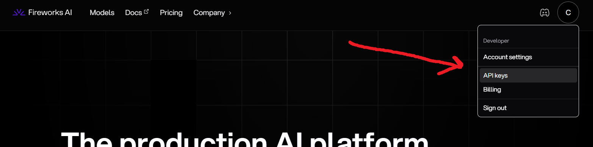
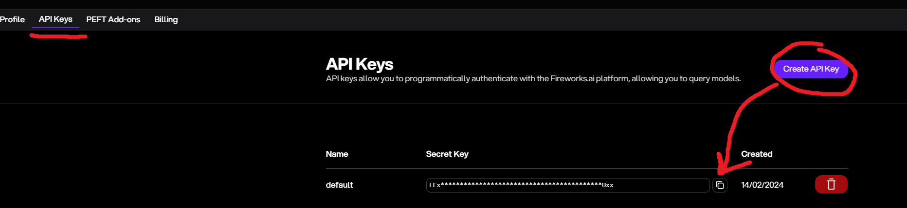

<div style="background-color: #0F0F0F; padding: 10px;">

# Man's New Best Friend


## Overview
<div style="white-space: pre-wrap;">In this guide we will go over how to make friends with AI! 
First, I will go over how to build a simple voice chat bot. 
Then, we can talk about how to add life to the AI.
</div>

## Table of Contents
- [Part 1: Setup](#part-1)
    - [Fireworks API key](#TTT-key)
    - [Deepgram API key](#STT-key)
    - [OpenAI API key](#TTS-key)
- [Part 2: Building the Voice Chat](#part-2)
    - [TTT](#TTT)
    - [STT](#STT)
    - [TTS](#TTS)
    - [TTTSTTTTS](#TTTSTTTTS)
- [Part 3: Bringing Your AI to Life](#part-3)
  - [Details](#details) TODO


<a id="part-1"></a><br>

## Part 1: Setup
You will need python and pip to follow along with the examples. You will also need an API key for each component; Text-to-Text (TTT), Speech-to-Text(STT), and Text-to-Speech(TTS).

I know it'a pain to need three different API keys but I promise that as soon as you get them, you will be speaking to your AI within minutes. Also they all offer free starting credits so you wont have to pay anything.
1. Fireworks API (TTT) https://fireworks.ai
2. Deepgram API (STT) https://deepgram.com
3. OpenAi API (TTS) https://openai.com 💩

<a id="TTT-key"></a><br>

## Fireworks Key



<a id="STT-key"></a><br>

## DeepGram Key


<a id="TTS-key"></a><br>
## OpenAi 💩 Key
https://platform.openai.com/api-keys
<br>
<br>
<br>

<a id="part-2"></a><br>

# Part 2: Building the Voice Chat
### 1. Place your API keys in a .env file in your working directory
Here are my keys as an example. Please DO NOT use them.
```
#.env
export DEEPGRAM_API_KEY='G6p9Bz2Lw1Qk7R8Xv3Tj5Hs0P4R9Wn3Yc2F8D1Ka'
export FIREWORKS_API_KEY='LEx98Gz2Lw5Np7Jm3Tc6Vd4P1Qk7R1Xo2Ys8HUxx'
export OPENAI_API_KEY='sk-4Qy7t8Lz1Mn3Wk5R2Xv9Hs6P0BqTj8GcD4F1Ra2'
```

### 2. Create a fresh environment
```bash
python -m venv ai-voice-chat
source ai-voice-chat/bin/activate # Linux
source ai-voice-chat/Scripts/activate # Windows
```
### 3. Install this module for python
```bash
pip install git+https://github.com/Collin-M-Brown/fire_chat.git
```
<a id="TTT"></a><br>

## Text-to-Text
The LLM will be the main engine behind your new friend. As of the current date (May 2024), llama3 70b seems to be the most reasonable choice for active voice chatting. The base model has a nice "human-like" touch to it that it is hard to find in other models. Through fireworks, you can achieve fast inferences speeds of sub 400ms initial response times which will be necessary for making the dialogue as response as possible.

Todo: 
- why fireworks (Speed)
- which benchmarks
- why llama

<br>
With the fire_chat module, you can start talking with your model with minimal setup

```python
from fire_chat import fire_llama

chat = fire_chat()
chat.set_prompt("You are a fictional character named Jam Saltman. You are an evil corporate tyrant who wishes to destroy all open-source AI to gain control over the masses. From now on all your responses should be in the form of dialogue spoken by Mr. Saltman.")
chat.add_user_message("Hi Mr. Saltman.")
for sentence in chat.get_easy_response():
    print(sentence)
```
get_easy_response will return a generator that will stream the respond in chucks separated by pauses (split on ,!?. etc...). It will also build the chat context automatically.

We need to get the response to the TTS software as fast as possible but we also want to make sure our chunks are large enough to be processed cleanly.
For an example, if you sent each word to TTS one at a time something like "Hi", "how", "are", "you" then the audio output will lack a uniform tone.
<a id="STT"></a><br>

## Speech-to-Text
Managing an audio stream can be somewhat tedious but we can knock it out in a second with a simple async queue setup.
```python
from fire_chat import easy_stt
import asyncio

output_queue = asyncio.Queue()
mic = easy_stt(output_queue=output_queue)
mic.start()

try:
    while True:
        if not output_queue.empty():
            transcript = output_queue.get_nowait()
            print(f"User: {transcript}")
except KeyboardInterrupt:
    mic.stop() # make sure to wait for the mic to stop
    print("Interrupted by user. Stopping...")
```

<br> If you want the AI to respond to everything you say, this will as a simple access point. But it can be rather annoying to have it go off when you don't intend it to. There are many solutions, here are a few
1. **Implement keyword trigger**: Only send user message to the AI after a specific word has been mentioned. This way the user will have control over when the AI responds. The issue is this will be less of a conversation and more of a QA
2. **Implement a minimum length:** For an example, don't send the AI the user message unless at least n words have been spoken. Something like "I uh..." wont trigger the AI response. The downside is that you can respond with a simple "Yes" or "No" as you might want to with in a real conversation.
3. **Implement push-to-talk keybinding:** This offers full control but puts more burden on the user.
4. **Use AI to detect end of speech:** This is the endgame goal. The technology exists but it's not quite refined yet.

<a id="TTS"></a><br>

## Text-to-Speech

Text to speech is the hardest part. The easy_tts module uses OpenAI tts for simplicity. But I will include some alternative methods for faster inference later in this guide. Notice how much cleaner it sounds when you only split text at pauses?
```python
from fire_chat import easy_tts
import time

with easy_tts() as speakers:
    speakers.speak("Hi")
    speakers.speak("how")
    speakers.speak("are")
    speakers.speak("you?")
    speakers.speak("Hi")
    speakers.speak("how are you?")
    time.sleep(7)
```
<a id="TTTSTTTTS"></a><br>

## Combining All Three
```python
from fire_chat import fire_llama, easy_stt, easy_tts
import asyncio

output_queue = asyncio.Queue()
chat = fire_llama()
mic = easy_stt(output_queue=output_queue)
mic.start()
chat.set_prompt("You are an evil AI named Evil Bob who hates all humans! Each response should be between two to three sentences.")
chat.set_max_tokens(100)

try:
    with easy_tts() as speakers:
        while True:
            if not output_queue.empty():
                transcript = output_queue.get_nowait()
                chat.add_user_message(transcript)
                print(f"User: {transcript}")
                response = []
                for sentence in chat.get_easy_response():
                    response.append(sentence)
                    speakers.speak(sentence)
                print(f"AI: {''.join(response)}")
except KeyboardInterrupt:
    mic.stop()
    print("Interrupted by user. Stopping...")
```

Congratulations. You are now voice chatting with your AI.

<a id="part-3"></a><br>

# Bringing Your AI to Life
The most basic "conversation" with an AI consists of a Q and A session. User speaks, AI responds, User speaks, AI responds... etc...

But real conversations don't follow a linear pattern. Sometimes human's respond instantly; sometimes they take a while to think. They can interrupt your or zone out when you're speaking. You might bring up a topic A but they might be fixated on topic B. They can agree with you when you are wrong, and disagree when you are right.

An AI that always listens to you and returns constant, factual, and respectful responses will be a useful addition to your toolbox; but could you really call it a friend?

# Todo
Talk about...
- Lowering latency
    - Bottlenecks
- Structure
    - Microservice
    - Multiprocess w/ IPC
    - Threading
- Dynamic personalities
- Emotion handling
- Dynamic response timers
- Context pruning
- Pruning text for audio
    - utf-8
    - sir-names
- Prompting
    - Avoiding fourth walling etc..
- Avoiding common pitfalls
    - Bad text
- Vision

</div>
