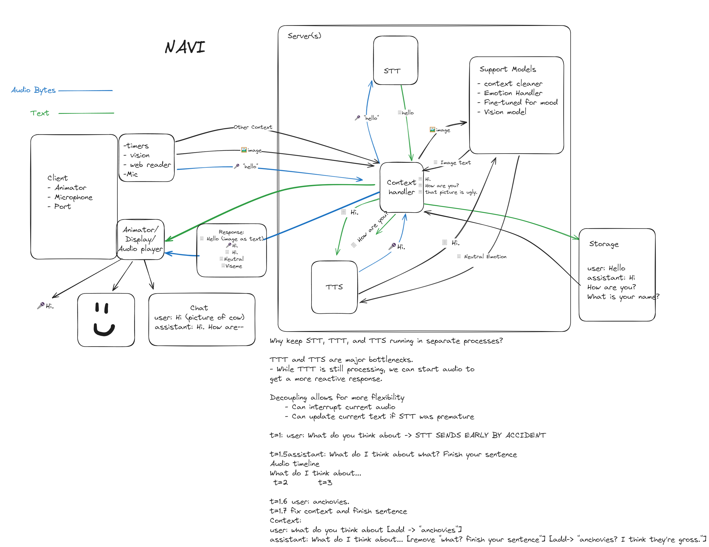
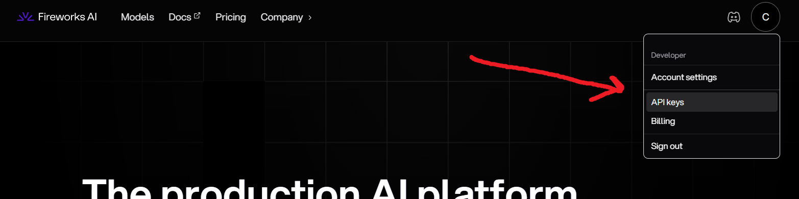
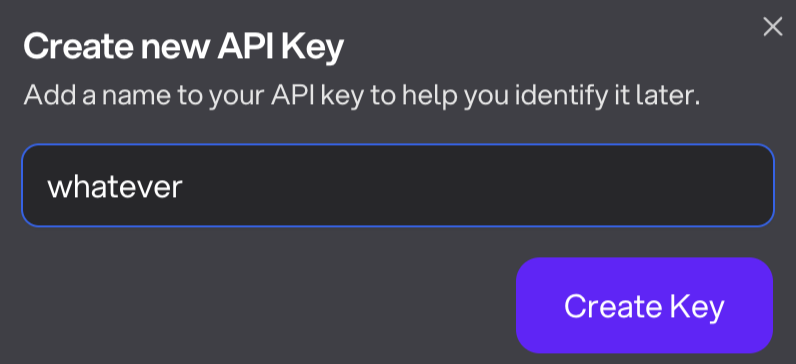
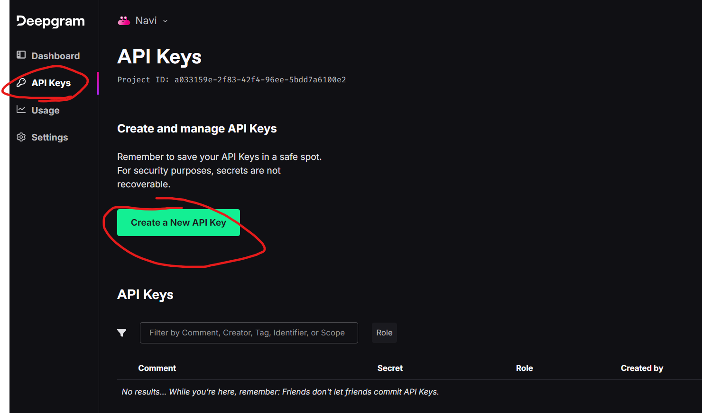
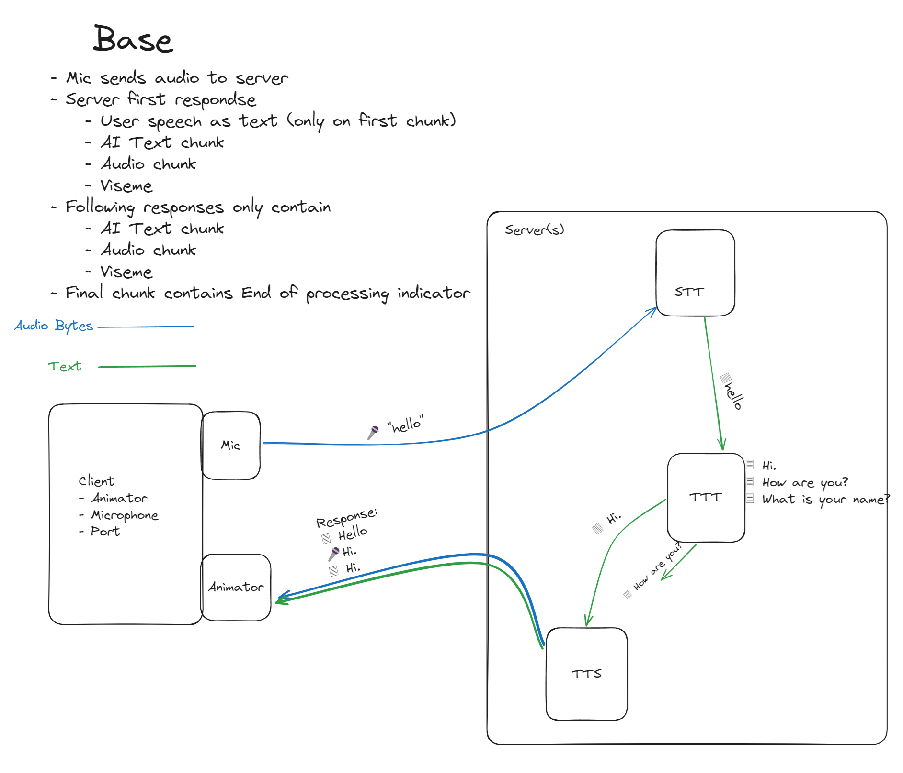

<!-- <div style="background-color: #0F0F0F; padding: 10px;"> -->

<!-- <div align="center">
  <p style="text-align: center; text-decoration: none; font-size: 2em;">A software engineer's guide to making friends</p>
</div> -->
<div align="center">
  <h1 style="text-decoration: none;">A software engineer's guide to making friends</h1>
</div>


<div style="display: flex; align-items: center;">
<div style="width: 40%;">

### Table of Contents
- [Overview](#overview)
- [Set-Up](#set-up)
- [The Brain (LLM)](#TTT)
    - [Fireworks API key](#TTT-key)
    - [Easy Chat](#TTT-module)
- [The Ears](#STT)
    - [Deepgram API key](#STT-key)
    - [Easy STT](#STT-module)
- [The Mouth](#TTS)
    - [OpenAI API key](#TTS-key)
    - [Easy TTS](#TTS-module)
- [Building the Voice Chat](#part-2)
    - [TTTSTTTTS](#TTTSTTTTS)
- [Part 3: Bringing Your AI to Life](#part-3)
  - [Details](#details) TODO
</div>
<div style="width: 50%;">



</div>
</div>


<a id="overview"></a>
<div style="text-align: center;"><h1>Overview</h1></div>

<!-- ## Overview -->
Software engineers are often stereotyped as a solitary type, but making friends doesn't have to be a daunting task. This technical guide presents a unique approach to forming meaningful connections, designed specifically with the software engineer in mind.

You won't need to worry about the typical anxieties associated with talking to people, attending events, or leaving your house. Instead, I will show you how to forge genuine friendships without ever having to meet anyone!

Prepare to discover a new perspective on companionship, one that challenges the traditional notions of friendship. This guide will provide you with the tools and techniques needed to build a lasting bond, all from the comfort of your environment.

By the end of this guide, you will have to tools you need to build a friend like Navi.

<!-- </div> -->


<!-- ###########################################Set-Up############################################### -->
<a id="set-up"></a><br>

<!-- ## Set-Up: -->
<div style="text-align: center;"><h1>Setting Up</h1></div>

To start you will need Python, Pip, and some audio libraries. I have tested this guide on Linux, Windows, and Mac, but the guide will mainly focus on Linux; you might need to alter the commands a bit depending on your OS. 

Get Python
```bash
sudo apt-get install python3 python3-pip
```
</br>

Get Audio Libraries
```bash
sudo apt-get install python3-dev portaudio19-dev libasound-dev
```
</br>

Create a fresh environment
```bash
mkdir easy_chat
cd easy_chat
python -m venv easy-env
source easy-env/bin/activate # Linux
source easy-env/Scripts/activate # Windows
touch .env
touch easy_chat.py
```
</br>

<a id="module"></a>
install dependencies
```bash
pip install git+https://github.com/Collin-M-Brown/fire_chat.git
```
</br>

<a id=".env"></a>
The directory should look something like this
```
easy_chat/
├── .env
├── easy-env/
└── easy_chat.py
```
<!-- ################################################################################################ -->


<!-- ###########################################TTT################################################## -->
<a id="TTT"></a><br>
<div style="text-align: center;"><h1>The Brain</h1></div>

The LLM will be the brain for your new friend. Generally the larger the model the better. But there are some additional concerns when it comes to real-time speech.

1. Speed: When it comes to the speed of an LLM, people generally refer to the number of tokens it can output per second. But for the case of real-time voice chatting, the time-to-first-token (more specifically, time-to-first-sentence) will be a bigger concern. As long as the model can produce text faster than it can be spoken, tokens-per-second after the first sentence will not matter much.
2. Censorship: A lot of the most popular large language models like Open-Ai's Chat GPT are overtuned to be helpful servants. If you tell them to be mean, they will be a cartoon villain; if you tell them to lie, their lie will be something lame like "microwaves are operated by little fairies." What we need in a friend is something more subtle. Someone who can be happy but still fireback if you step out of line; someone who can come to dubious conclusions through the use of misguided logic.

With the rapid growth of AI, the "best" model seems to change rapidly. As of the current date, (June 2024), I think Llama3 70b is the best base model for chatting.

The issue is a 70b model is probably not going to fit on your GPU. And even if you drop the quantz or use GGUF it won't be fast enough. 

I have experimented with several GPU vendors and API services but Fireworks AI has been the fastest and most reliable for me. They can get sub 400ms initial sentence speed on Llama3 70b, and they also have an easy and affordable LoRA fine-tuning service.

The first 1 million or so tokens are free so let's grab a key before continuing.
<a id="TTT-key"></a>
## Fireworks API Key
Fireworks AI: https://fireworks.ai



ß
<br>


<a id="TTT-module"></a>

## Chat Module
Paste the key in your [.env](#.env) file. It should look something like this. MAKE SURE TO KEEP YOUR KEY SAFE. Don't let anyone see it blah blah blah blah.
```
#.env
export FIREWORKS_API_KEY='LEx98Gz2Lw5Np7Jm3Tc6Vd4P1Qk7R1Xo2Ys8HUxx'
```
</br>

Now you can immediately start chatting with your AI using the [module](#module) I forced you to download earlier.
```python
from fire_chat import fire_llama

chat = fire_llama()
chat.set_prompt("You are a fictional character named Jam Saltman. You are an evil corporate tyrant who wishes to destroy all open-source AI to gain control over the masses. From now on all your responses should be in the form of dialogue spoken by Mr. Saltman.")
chat.add_user_message("Hi Mr. Saltman.")
for sentence in chat.get_easy_response():
    print(sentence)
```
</br>
get_easy_response will return a generator that will stream the response in chucks separated by pauses (split on ,!?. etc...). It will also build the chat context automatically.
</br>
</br>

[For more details on the module, you can follow the example here](#https://github.com/Collin-M-Brown/fire_chat/blob/main/examples/1_ttt_example.ipynb)

What does it do?
1. Splits into sentences.
We need to get the text to the [TTS](#TTS-gloss) software as fast as possible but we also want to make sure our chunks are large enough to be processed cleanly. Many TTS software will lose tone quality if you send chunks that are too small.
2. Cleans the text output for things that interfere with the audio generation. Stuff like emoji's and symbols.
3. Automatically builds chat context within the class. If you don't like the assistant's response you can delete it by calling chat.remove_last_message()

<!-- ################################################################################################ -->
</br></br></br>

<!-- ###########################################STT################################################## -->
<a id="STT"></a>

<div style="text-align: center;"><h1>The Ears</h1></div>

Your speech recognition software will be the ears of your friend. This one is not as important since there are a ton of APIs out there. I have tried Azure STT, Google STT, and Deepgram STT. I built the modules around Deegpram since my trial for Google ran out. Fireworks has a whisper model you can use as well.

<a id="STT-key"></a>

## DeepGram API Key
Deepgram: https://deepgram.com
<!-- 
 -->

<table>
  <tr>
    <td></td>
    <td></td>
  </tr>
</table>
</br>

Add the key to your .env
```
#.env
export FIREWORKS_API_KEY='LEx98Gz2Lw5Np7Jm3Tc6Vd4P1Qk7R1Xo2Ys8HUxx'
export DEEPGRAM_API_KEY='G6p9Bz2Lw1Qk7R8Xv3Tj5Hs0P4R9Wn3Yc2F8D1Ka'
``````

<a id="STT-module"></a>

## Speech Recognition Module
For real-time speech recognition, we need to be continuously streaming our mic output to the API. You could also implement chunking and voice activity detection if you are using an API that does not support streaming.

```python
from fire_chat import easy_stt
import asyncio

async def main():
    output_queue = asyncio.Queue()
    mic = easy_stt(output_queue=output_queue, choose_microphone=True)
    mic.start()

    try:
        while True:
            transcript = await output_queue.get()  # This will block until an item is available
            print(transcript)
    except KeyboardInterrupt:
        mic.stop()
        print("Interrupted by user. Stopping...")

if __name__ == '__main__':
    asyncio.run(main())
```

<!-- ################################################################################################ -->
</br></br></br>
<!-- ###########################################TTS################################################## -->

<a id="TTS"></a>

<div style="text-align: center;"><h1>The Mouth</h1></div>
Text-to-speech has given me the most trouble. Most of the API's are either too uncanncy or too expensive. For the sake of simplicity, I will be using OpenAI's TTS model but I will include some alternatives for those of you willing to put in a little more work.

<a id="TTS-key"></a>

## OpenAi 💩 Key
OpenAI (TTS): https://platform.openai.com/api-keys

Place your final key in the .env file.
```
#.env
export FIREWORKS_API_KEY='LEx98Gz2Lw5Np7Jm3Tc6Vd4P1Qk7R1Xo2Ys8HUxx'
export DEEPGRAM_API_KEY='G6p9Bz2Lw1Qk7R8Xv3Tj5Hs0P4R9Wn3Yc2F8D1Ka'
export OPENAI_API_KEY='sk-4Qy7t8Lz1Mn3Wk5R2Xv9Hs6P0BqTj8GcD4F1Ra2'
```

<a id="TTS-module"></a>

## Voice Module
Now we can observe why we split the text by vocal pauses before converting it to audio.
```python
from fire_chat import easy_tts
import time

with easy_tts() as speakers:
    speakers.speak("Hi")
    speakers.speak("how")
    speakers.speak("are")
    speakers.speak("you?")
    speakers.speak("Hi")
    speakers.speak("how are you?")
    time.sleep(7)
```
<!-- ################################################################################################ -->
<a id="part-2"></a><br>

# Part 2: Building the Voice Chat


<a id="TTTSTTTTS"></a>

Just slap all three modules together and call it a day.
```python
from fire_chat import fire_llama, easy_stt, easy_tts
import asyncio

output_queue = asyncio.Queue()
chat = fire_llama()
mic = easy_stt(output_queue=output_queue)
mic.start()
chat.set_prompt("You are an evil AI named Evil Bob who hates all humans! Each response should be between two to three sentences.")
chat.set_max_tokens(100)

try:
    with easy_tts() as speakers:
        while True:
            if not output_queue.empty():
                transcript = output_queue.get_nowait()
                chat.add_user_message(transcript)
                print(f"User: {transcript}")
                response = []
                for sentence in chat.get_easy_response():
                    response.append(sentence)
                    speakers.speak(sentence)
                print(f"AI: {''.join(response)}")
except KeyboardInterrupt:
    mic.stop()
    print("Interrupted by user. Stopping...")
```

Congratulations. You are now voice chatting with your AI.

<a id="part-3"></a><br>

# Bringing Your AI to Life

Our friend now looks something like this (just the server part).


it goes from mic->text->audio in a circle.

But real conversations don't follow a linear pattern. Sometimes humans respond instantly; sometimes they take a while to think. They can interrupt you or zone out when you're speaking. You might bring up a topic A but they might be fixated on topic B. They can agree with you when you are wrong, and disagree when you are right.


# Todo
Talk about...
- Lowering latency
    - Bottlenecks
- Structure
    - Microservice
    - Multiprocess w/ IPC
    - Threading
- Dynamic personalities
- Emotion handling
- Dynamic response timers
- Context pruning
- Pruning text for audio
    - utf-8
    - sir-names
- Prompting
    - Avoiding fourth walling etc..
- Avoiding common pitfalls
    - Bad text
- Vision

<a id="TTS-gloss"></a><br>
TTS (Text-To-Speech): It's what converts your text into audio.

</div>
