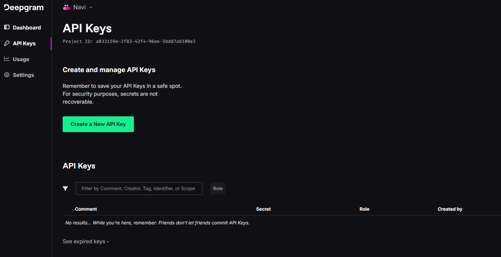
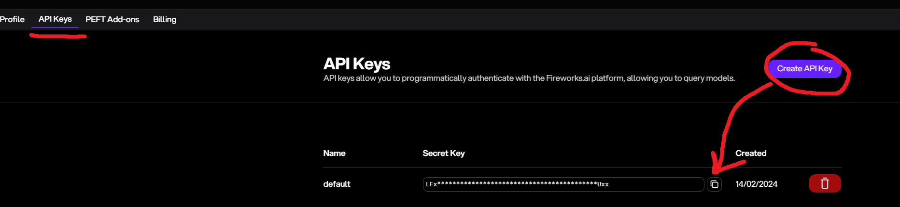

# AI: Man's new best friend


# Table of Contents: 
- Overview
- Part 1: Basic voice chat
    - Components
    - Setup
    - STT
    - TTT
    - TTS
- Part 2: Bringing your character to life
    - Common pitfalls
    - Details
    - Replacing OpenAI

# Overview
In this guide we will go over how to make friends with your AI! First, let's get you set up with some simple tools so you can start voice chatting with your AI immediately. Afterwords we can dive into some of the nitty gritty details will bring them to life.

# Components
1. Text-to-text (TTT aka your large language model)
2. Speech-to-text (STT)
3. Text-to-speech (TTS) 

You will also need a working microphone, speakers, python, and pip to follow along.

# Setup 
Let's get the API keys out of the way. I know it seems like a pain to need three different API keys but I promise that as soon as you get them, you will be speaking to your AI within minutes. Also they all offer free starting credits so you wont have to pay anything.
1. Fireworks API (TTT) https://fireworks.ai
2. Deepgram API (STT) https://deepgram.com
3. OpenAi API (TTS) https://openai.com 💩 (I will go over a local replacement later in the guide)

### 1. DeepGram



### 2. Fireworks



### 3. OpenAi 💩
https://platform.openai.com/api-keys

### 1. Place your API keys in a .env file in your working directory
Here are my keys as an example. Please DO NOT use them.
```
#.env
export DEEPGRAM_API_KEY='G6p9Bz2Lw1Qk7R8Xv3Tj5Hs0P4R9Wn3Yc2F8D1Ka'
export FIREWORKS_API_KEY='LEx98Gz2Lw5Np7Jm3Tc6Vd4P1Qk7R1Xo2Ys8HUxx'
export OPENAI_API_KEY='sk-4Qy7t8Lz1Mn3Wk5R2Xv9Hs6P0BqTj8GcD4F1Ra2'
```

### 2. Create a fresh environment
```bash
python -m venv ai-voice-chat
source ai-voice-chat/bin/activate # Linux
source ai-voice-chat/Scripts/activate # Windows
```
### 3. Install this module for python
```bash
pip install git+https://github.com/Collin-M-Brown/fire_chat.git
```

# Text-to-Text
The LLM will be the main engine behind your new friend. As of the current date (May 2024), llama3 70b seems to be the most reasonable choice for active voice chatting. The base model has a nice "human-like" touch to it that it is hard to find in other models. Through fireworks, you can acheive fast inferences speeds of sub 400ms initial response times which will be nessisary for making the dialogue as response as possible.

<br>
With the fire_chat module, you can start talking with your model with minimal setup

```python
from fire_chat import fire_llama

chat.set_prompt("You are a fictional character named Sam Saltman. You are an evil coorperate tyrant who wishes to destroy all open-source AI to gain control over the masses. From now on all your responses should be in the form of dialogue spoken by Mr. Saltman.")
chat.add_user_message("Hi Mr. Saltman.")
for sentence in chat.get_easy_response():
    print(sentence)
```

# Speech-to-Text
Managing an audio stream can be somewhat tedius but we can knock it out in a second with a simple async queue setup.
```python
from fire_chat import fire_llama, lazy_mic
import asyncio

output_queue = asyncio.Queue()
mic = lazy_mic(output_queue=output_queue, choose_microphone=True)
mic.start()
```

<br>Now we can combine parts 1 and 2 to talk directly to our AI.

```python
from fire_chat import fire_llama, lazy_mic
import asyncio

chat = fire_llama()
chat.set_prompt("You are an evil AI who hates all humans! Each response should be between two to three sentences.")
chat.set_max_tokens(150)

output_queue = asyncio.Queue()
mic = lazy_mic(output_queue=output_queue, choose_microphone=True)
mic.start()

try:
    while True:
        if not output_queue.empty():
            transcript = output_queue.get_nowait()
            chat.add_user_message(transcript)
            print(f"User: {transcript}")
            response = []
            for sentence in chat.get_easy_response():
                response.append(sentence)
            print(f"AI: {''.join(response)}")
except KeyboardInterrupt:
    mic.stop()
    print("Interrupted by user. Stopping...")
```

<br> If you want the AI to respond to everything you say, this will work. But it can be rather annoying to have it go off when you don't intend it to. There are many solutions, here are a few
1. Implement keyword trigger. Only send user message to the AI after a specific word has been mentioned. This way the user will have control over when the AI responds. The issue is this will be less of a conversation and more of a QA
2. Implement a minimum length before the AI responds. For an example, don't send the AI the user message unless at least n words have been spoken. Something like "I uh..." wont trigger the AI response. The downside is that you can respond with a simple "Yes" or "No" as you might want to with in a real conversation.
3. Use AI to detect when you are finished speaking. This will give the most natural results but it can also add additional latency to the reply depending on how complex your solution is.

# Text-to-Speech


# Bringing your new friend to life
The most basic "conversation" with an AI consists of a Q and A session. User speaks, AI responds, User speaks, AI responds... etc...

But real conversations don't follow a linear pattern. Sometimes human's respond instantly; sometimes they take a while to think. They can interrupt your or zone out when you're speaking. You might bring up a topic A but they might be fixated on topic B. They can agree with you when you are wrong, and disagree when you are right.

An AI that always listens to you and returns consistant, factual, and respectful responses will be a useful addition to your toolbox; but could you really call it a friend?

